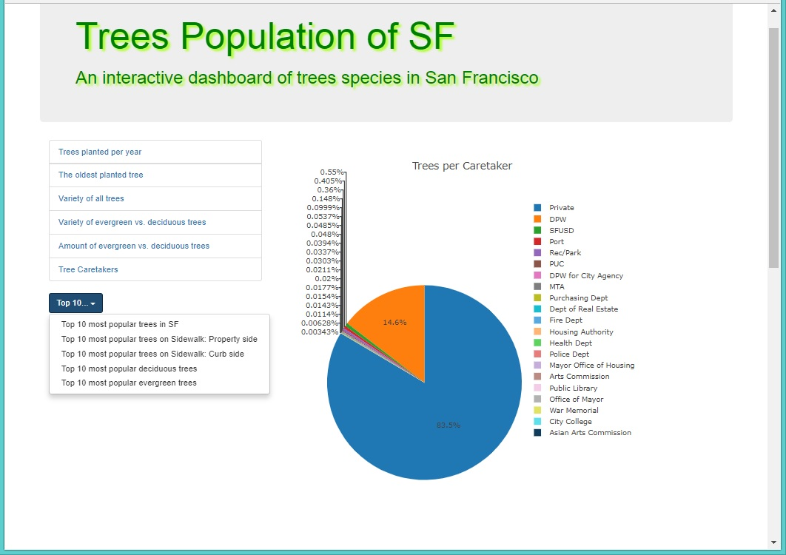
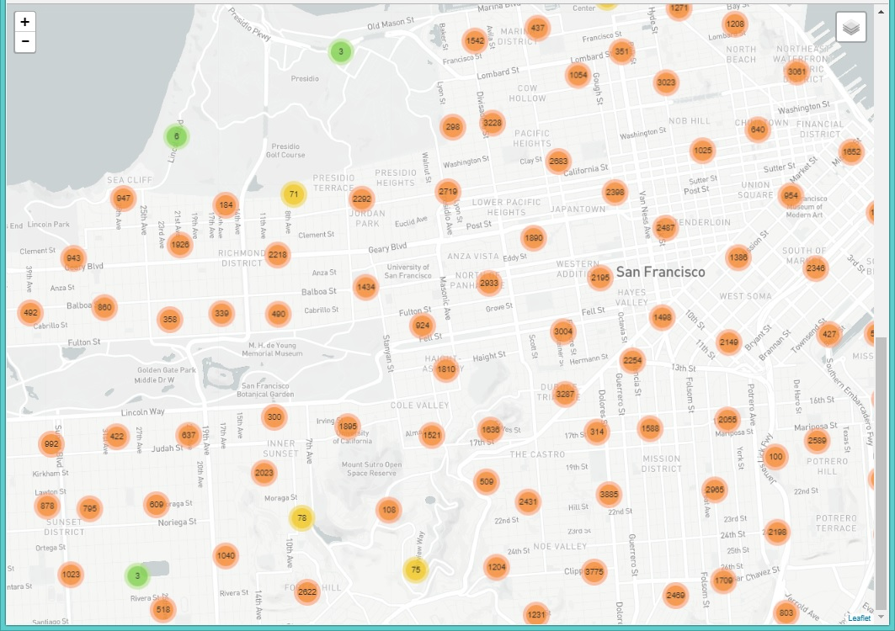

# Street Trees Population of San Francisco
## Group Project

An interactive dashboard and map to explore the [SF STREET TREES dataset](https://www.kaggle.com/jboysen/sf-street-trees/data).

## Try it on [Heroku.](https://street-trees-population-sf.herokuapp.com/)

### Tools used: Python Flask powered RESTful API, HTML/CSS, JavaScript, D3.js, SQLite & SOLAlchemy, Plotly, Leafleat.

